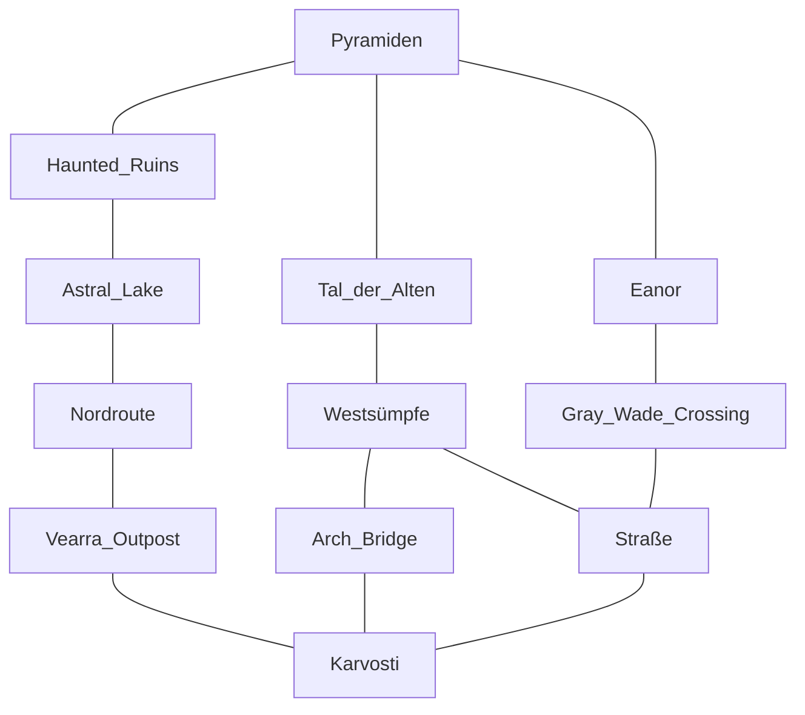

#template [[202201051118 Sly Flourish MOC]] 
[[Lazy DM Session Worksheet Template.pdf]]
[[Sly flourish Prep Template]] [[202112310001 Abenteuer-Gestalten MOC]]
[[Symbaroum Journey Board.excalidraw]]
# Summary
- Chars
	- 
- Locs
	- 
## Review Characters
- Paco [[Symbaroum PC Paco]]
	- Fullangra war draußen, was will sie jetzt: will losziehen und weitere Zwerge suchen. Nach weg die Zwerge von Xiximanter zu befreien
	- Xiximanter ist nicht erschienen, sondern Break link hat einfach nicht funktioniert, weil der Zauber zu high level war (kompliziertes Ritual)
- Rojazz [[Symbaroum PC Rojazz]]
	- Will Elch finden
## Strong Start
- Es fängt heftig an zu schneien!
- Aufbruch. Vision von [[Symbaroum Monster Oroke]]
- Set Milestone
## 10 Secrets
1. [ ] [[Symbaroum Monster Xiximanter]] war gegner von [[Monster Xisor]] als Hook für [[Hexcrawl durch die Westsümpfe]]. Westsümpfe im Winter.
2. [ ] Der Elch ist Moosejaws aus Frostmaiden Lonelywood, White Moose p 79
3. [ ] Auf Karvosti befinded sich [[Treasure Karlabans Bane]]. 
4. [ ] Wenn die Ambrier den Turm einnehmen willl kommt zu [[Manifestationen von Orokes Erwachen]], Aloena lässt Oroke erwachen
7. [ ] [[Faction Sovereign Oath]] schließt sich Tharaban nicht an und lässt Karvosti einnehmen. Breiten sich nach osten aus.
8. [ ] Kullinan Furia ist im Lager, weil er einen Kontrollpunkt der Ley Line vermutet. Falsch. Ist weiter westlich beim Magischen Turm. [[Davokar Pentagon Map new.png]].
9. [ ] 5000 Soldaten sind auf Karvosti marschiert.
5. [x] Tharaban, Crueljaw und die meisten ständigen Bewohne hatten sich auf Karvosti in der Festung verschanzt. Sie hatten gehofft mit Heldenmut die Überläufer zum Sovereign oath wieder zurückzugewinnen. In dieser Situation kommen die PCs an. Stalemate
6. [x] Der Sovereign Oath übernimmt den Südwestlichen Teil von Davokar
10. [x] Der Sovereign oath hängt alle Ambrier die sie sehen. Intifada.
## Scenes je nach Abenteuerart
- hanging tatooed in der nähe des [[2047 Zwillingsturm Jachin]].
![[Encounters MOC#Planned Encounters]]
##  Locations 
- 
Location links from database, tags
[[Davokar 20km long diag to 10 km short diag to 2km .wxx]]

[[Pointcrawl MOC]]

## NPCs
- [[Symbaroum Monster Erado]]
## Monsters
[[Symbaroum Monsters MOC]]
[[Symbaroum Monster frostlight alt dmg resolute and d4 temp corr res save oder zwangshandlung Geisterecho]]
[[Symbaroum Monster Lostling Possession]]
[[Symbaroum Monster Queens Ranger]]

## Treasure
[[Ruins GM Index#Rewards]]
[[DMDavid XP for Discovery Table]]
## Rewardable Scenes 1-4: 
- Kampf 250 xp
- Milestone: Crueljaw finden
- Scene auf Karvosti
## Milestone XP

## Notes
- Iasogois Schatzjäger suchen sarvola
- troll soll paco ein kurzschwert wie von iasogoi machen. 
- jeder PC nimmt einen Zwerg mit, so dass Zwerge befreundet mit Pc. 
	- FElix nimmt [[Monster Ravn der Magier]]
	- Rojazz nimmt [[Monster Roff]]
	- Wenn treffen auf Waldgott oder Magier, fragen, ob die break link machen kann an zwergen.
- [[Symbaroum Monster Kustas]] von glint befreit. soll sich beweisen in pyramide. zweite chance
- Fullangra soll auch weg finden zwerge zu dispellen. Zieht los.
- [[202201311237 Monster Lasifor Angathal Taar Spinnenlich]] gibt PC spinnennektar agiert als [[Strong Purple Sap DC 20 60 Th 1 clear d8 temp cort]] oder als pheromon für spinnen. 
- [[Ambrian male names]]
- In [[201904281322 Symbaroum Location Grey Wade Crossing]] rasten sie und hören von marodierenden Barbaren. Eher nördliche Clans. 
- Treffen auf Straße Bertalan ![[IMG_2678.jpeg|200]]. Anführer von Pionier truppe. 10 leute und er.
- sovereign oath agiert zwischen karvosti und fluss eanor, bisher kein großes lager gefungen
- In der Nach gegen 2-3 Uhr dröheh im Kopf, traumen wach zu sein. bild von Oroke [[Oroke.jpeg]]
- [[Faction Haus Kohinoor]]
- Sehen ca 100 m hohen Turm. Symbarisch. Schon abgefischt. Bisher kein Zweck erkennbar. (heißt das Leyline ist inaktiv?, oder muss erst zweiter Turm aktiviert werden?)
- 1-2 Tage später. Es wird abend. Lichtung mit Baum. Dort 7 Barbaren um Lagerfeuer. Am Baum Bertalam und seine Einheit erhängt im Baum.
- An die Barbaren kommen langsam bleiche Lichter. 
- [[202201261028 0 0 0 HUD House-rules]]

# Logs

- [[Session 5001.mp3]]
- [[Session 5002.mp3]]
- [[Session 5003.mp3]]
- [[Session 5004.mp3]]
	- Kustas Gefangen genommen. Käfer in Glas. haben ihn zur pyramide gebracht. Zwerge haben gesagt, dispell magic hat nicht geklappt.
- [[Session 5005.mp3]]
	- kustas nicht den spinne übergeben. er möchte nicht arach werden. Kustas noch etwas impulsiv bei Grundbedürfnissen, so dass er noch gefesselt bleibt. Iasogoi geht zu Sarvola. Jeder PC nimmt doch einen Zwerg mit um Zwerge zu binden und break link zu versuche.
- [[Session 5006.mp3]]
	- zwerg mitnehmen besser, weil guter sidekick. Rojazz nimmt Soldatenzwerg Roff mit und Paco nimmt Ravn mit. Kustas muss sich einfinden, die anderes sollen auf ihn aufpassen und über ihn richten.
- [[Session 5007.mp3]]
	- Kustas muss sich beweisen, dann kann er vieleicht seine familie nachholen. Rojazz in feld einschreiben. Fullangra schnappt sich ein paar zwerge und will nun die welt kennenlernen. die pyrmide bleibt aber ihr basis. sie wäre offen für eine große geste von paco. der sagt nebenbei und ohne ihr in die augen zu sehen, dass sie nach möglcihkeiten von break link suchen soll. Spinnen sind noch da und schicken auch suchtrupps los
- [[Session 5008.mp3]]
	- spinnen bleiben erstmal im östlichen wald, weil im westen krieg. paco fragt nach ausweis, mit dem die pc als spinnenfreunde gekennzeichnet werden. pc bekommen [[Symbaroum Item Arach Nektar]]. kleine flasche. sollen geringe menge auf haut auftragen, kenzeichnet pc als freunde. vielleicht wenn alles auf die haut aufgetragen, können pc vielleicht spinenn kontrollieren? wenn sie die ganze flasche trinken, reduziert es corruption wie [[Strong Purple Sap DC 20 60 Th 1 clear d8 temp cort]] ^99a2ef
- [[Session 5009.mp3]]
	- ziele in karvosti: elmendra, elch, krieg. laufen am fluss eanor entlang. dort erstes mal verlaufen, kampf mit spinenn, corrupten feen. dort gray wade crossing und dort tagebuch gefunden.
- [[Session 5010.mp3]]
	- gray wade crossing muss ein hex weiter nördlich sein. Dann auf der straße weiterziehen, wo auch die soldaten sind, oder weiter im wald. auf der straße erfahren sie, dass karvosti belagert ist. er fängt an sehr stark zu schneien. 20 cm schnee. rüstung umgebaut mit fellfütterung. lieber neben der straße wandern. keine großen truppenbewegungen mehr, aber konstanter verkehr. immer mehr pioniere, weniger kämpfer.
- [[Session 5011.mp3]]
	- pioniere, brückenbauer, mauer untertunneln, gräben bauen. rojazz läuft mit fackel vom wald auf die straße und spricht guppe von pionieren an. ein typ mit zigarre: du bist ambrier und läufst durch den wald? bist du wahnsinnig. du wirst von barbaren aufgefressen! leutnant Bertalam sagt: du warst noch nicht in der nähe von karvosti. bringt jüngere einheiten von pionieren nach karvosti. barbaren haben sich auf dem felsen verschanzt, pioniere sollen helfen, die armee auf karvosti zu bringen. Rojazz fragt, was ist an karvosti so spannend. bertalam die barbaren sind total ausgeflippt. es gibt typen, die haben wir vorher nie gesehen, die machen jagd auf ambrier. tharaban scheint die kontrolle verloren zu haben. haben schon mehrere dörfer ausgelöscht.
- [[Session 5012.mp3]]
	- es gab mehrere massaker an ambrischen einheiten. die ambrischen soldaten sind zunehmend gegen barbaren. Bertalem musste mehrer seiner freunde vom baum schneiden, nachdem sie von barbaren aufgeknüpft wurden. Rojazz sagt, dann will er doch nicht nach karvosti. bertalam sagt, südlich des flusses eanor ist es noch sicher. verrückte barbaren sind zwischen karvosti und fluss eanor. unklar ob es zwischen den barbaren konflikte gibt. es sind viele. ziehen durch den wald und suchwn ambrier. bisher kein großes lager gefunden. wurden gesehen. unklar von welchem stamm. eher nördliche stämme. baiaga gespalten…
- [[Session 5013.mp3]]
	- ... vojvod, enoai. auch andere barbaren halten sich bedeckt mit informationen an ambrier. Paco gilt nicht als ambrier. wenn zusammen reisen unklar, womit sie identifiziert werden. rojazz sagt zu bertalam: wenn du beremo siehst, grüß ihn von 

rojazz. bertalam sagt, vielen dank, aber beremo ist viel zu hohes tier, als dass bertalaem einfach zu ihm gehen könnte und gruß ausrichten. laufen neben straße her.
- [[Session 5014.mp3]]
	- boden zunehmend sumpfiger. es wird dunkler. rand vom spreewald. sind am  Gray wade crossing vorbeigekommen. voll von soldaten. bisher nicht requiriert. machen gutes geschäft. rast. schlafen unruhig. beide haben traum. träumen als würde sich schlafen. dröhnen. wird immer lauter. bild im kopf flackert auf. nicht ähnlich wie pflanzenwesen aus tomb of dying dreams.
- [[Session 5015.mp3]]
	- wachen gleichzeitig auf. die flaschen von spinnenelixier tönen wie klangschalen. nicht bedrohlich, nicht persönlich, aber gefühl von vertigo, vom blick in die tiefe. paco sagt: du hälst wache und schläft weiter. rojazz trägt etwas vom spinnennektar auf die haut auf.
- [[Session 5016.mp3]]
	- es tut sich nichts durch das auftragen. rojazz bleibt wach. traum war 2-3h. es wird noch kälter. sumpf nasse füße. grey wade crossing: rojazz wollte handschuhe schuhe kaufen. paco wird von elfenumhang warmgehalten. zwerge sind etwas unangenehm, weil keine emotionen. kämpfen brutal aus spaß. roff und ravn nicht. wohin nun? paco fragt onrax, ob er für paco kurzschwert bauen kann, wie es iasogoi hat.
- [[Session 5017.mp3]]
	- paco hat angst, zwischen die fronten zu geraten. etwas in gray wade crossing gehört: alle die aus dem norden/karvosti kommen warnen von barbaren und berichten von massakern. elmendra. nichts gehört. elmendra wird von königin und witchhuntern gejagt. sie kann eigentliclh nicht in ambrien sein. aber im südlichen davokar kann sie aber auch nicht sein. elfen verstecken sie ja auch nicht. gibt es noch schatzjäger in davokar. thistle hold ja von statthalter kontrolliert. alle schatzjäger mit etwas geld sind geflohen.
- [[Session 5018.mp3]]
	- felix erinnert sich, dass königin sich komisch verhält/angeknackst/wütend. NACHFORSCHEN. später auf der straße gehen. von elfen in der gegend wurde nichts berichtet.
- [[Session 5019.mp3]]
	- sind auf route, sehen nördlich einen fast 100m hohen turm. abgefischt. keiner weiß, was der turm macht. in der tiefe des turmes gibt es dunklen stein, keiner weiß, was der turm macht. an der straße hoher baum darunter lagerfeuer. darum gestalten. gehängte am baum. turm im hintergrund etwas weiter weg. baum beliebter rastplatz an der straße. gehängte. unter dem baum 7 gestalten. straße schlängelt sich …
- [[Session 5020.mp3]]
	- … zwischen teichen hindurch bei sumpfigem boden. sehen dass es eindeutig barbaren sind. pc sind bisher noch nicht entdeckt. einer der gehängten ist bertalam. hinter den barbaren, neben dem baum. blasses lichter, die langsam auf barbaren zufliegen. flohs rüstung rußig. disadvantage auf schleiche. paco möchte unnoticeable haben. nach dnd zu hohe stufe. aber er kann invisibility haben.
- [[Session 5021.mp3]]
	- milchig weißes licht. eins geht nach oben in eine leiche. zweites licht in barbaren. barbaren streiten sich. warum nimmst du mein bier. _ich hatte so lang kein bier, gib mir dien bier_ . einer der erhängten fängt an sich zu bewegen. paco hält kurz hand nach vorn und sagt NEIN. merkt es geht nicht und rennt weg.
- [[Session 5022.mp3]]
	- licht fliegt lansam auf paco zu. hält abstand aber kommt näher. frostlichter. kinderseelen, mother marsch, pakt.
- [[Session 5023.mp3]]
	- eigenlich anderes monster, lostling nicht frostlight. paco wird nervös. fragt rojazz was soll ich tun? es kommt näher.
- [[Session 5024.mp3]]
	- ghost candle, sichtbar, wraith dust: gegenständlich. hat jemand magische waffe? paco nimmt magischen Dolch an rojazz. der sagt, wieviel magiscje gegenstände hast du denn? nächste runde wraith dust. holen.
- [[Session 5025.mp3]]
	- licht fliegt bis auf 30 fuß auf paco zu.
- [[Session 5026.mp3]]
	- zombie bertalam zieht messer aus gürtel und schneidet fesseln zwischen händen durch. barbaren streiten sich, prügelei geht los. licht groß wie basketball. paco schießt mit magischem pfeil.
- [[Session 5027.mp3]]
	- trifft. w6+3 schaden. 9 hp schaden. schießt wie durch nebel und zieht substanz mit. pfeil wird gebremst durch lostling. paco will nicht weg, denn rojazz kann nicht als bonus action dashe. rennen weg. keine opprotunity attack weil lostling zu weit weg. fünf weitere lostlings. steigen hinter barbaren auf
- [[Session 5028.mp3]]
	- können wegrenne, dann müssen sie aber schnell weg. fünf weitere lichter. 2 davon richtung pc. sie hören plopp, zombie-bertalam lässt sich vom baum fallen. barbaren bekommen weitere lichter nicht mit. dann rennen sie weg. der besessene barbar hält weiteren barbar fest als irrlichter näher kommen. 100 m weg. bogen hat definierte reichweite. reicht.
- [[Session 5029.mp3]]
	- daneben. nun von barbaren bemerkt weil sie pfeil bemerkten. barbaren laufen auch weg außer dem besessenen und dem festgehaltenen. 2 von den barbaren tätoviert. einer davon mit freiem oberkörper. scheint nicht zu frieren trotz arschkälte. anderern auch tätoviert aber gekleidet. unterarme sind frei. ein tattoo am unterarm brennt kurz auf, dann schießt er drei flammenpfeile aus seinen fingern. zwei treffen lichter. feierpfeile explodieren in lostling. wenn jemand stribt such sich lostling den nächsten wirt.
- [[Session 5030.mp3]]
	- lostlings sammeln sich und fliegen auf barbaren zu. lostlings werden barbaren besetzen. die barbaren können schneller laufen, als die lichter fliegen. wie gewinnen? wraith dust wenn auf einem haufen. wegrennen zu pferden, bevor die lichter die barbaren besetzen haben.
- [[Session 5031.mp3]]
	- baum war  von warmen licht des lagerfeuers von unter erleuchtet. nun von kalten, weißlichem licht erleuchtet, weil immer mehr. irrlichter aus dem sumpf auftsteigen. hinter em baum see mit nebel. fahren in gehängte. die zwei barbaren vor dem baum stehen gegenüber und fassen sich befrendet an. irrlichter wollten körperwärme. noch 3 trage bis karvosti.

