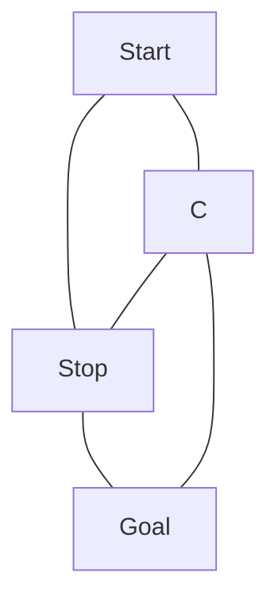

## use mermaid
https://mermaid-js.github.io
works natively in obsidian without plugin

[[201909140941 Alex Schroeder_ 2017-02-20 Dungeon Mapping]]

# Large Locations
Ancient watchtower
Seedy city 
Elven respite 
Haunted manor
Giants’ fortress
Ruined castle
Pirate docks
Dwarven mines
Vast metropolis
Warlord’s bastion
War-ravaged dam
Riverside town 
Shadowgate keep
Blood-soaked arena 
Mountain of doom
City of towers
Library of the ages
Grand observatory
Goblin king’s citadel
Sunken ziggurat

# Small Locations
Dragon’s graveyard
Tar pits  
Bloody battlefield 
Crashed airship
Elven portal
Standing stones
Bridge of teeth
Primeval shrine
Shining oasis
Fetid swamp
Mesa of tusks  
Travelers’ rest  
Fey spring  
Titanic skull  
Huge throne room
Fallen statue
Ghostly shipwreck
Bottomless shaft
Ring of teeth
Monstrous lair

# Routes
Ancient roadway
Old aqueduct  
Peaceful seacoast 
The shadowpath
Overgrown vale
Dry riverbed
Well-traveled road
Hidden stair
Golden stag’s trail
Fey forest path
Cracked plains  
Precarious switchback
Goblin tunnels  
Passages of the beast 
Sapphire rapids
Subterranean trek
Thunderous gap
Lost mines
Road of despair
Path of bones

Das ziel ist im pointcrawl oder im dungeon am anfang aber verschlossen so dass man weitere points braucht um den schlüssel zu finden. Dann muss an der verschlossenen tür ein hinweis auf den schlüssel zu finden sein.
- spuren eines stoneshape zaubers, leiche des abenteurers der reinwollte, tagebuch dass wand of stoneshape gefunden, federn und harpyshit als hinweis auf den mörder (der den wand nun hat.
- mundane: sichere tür verschlossesn. Schlüssel haben offensichtlich die wärter (Gefängnis, Ausstellung/Museum, Zoo, Ranger wenn der verschlossene ort ein rangerunterschlupf ist)
- A caster did a warding spell. The spell has a powersource which has to be destroyed